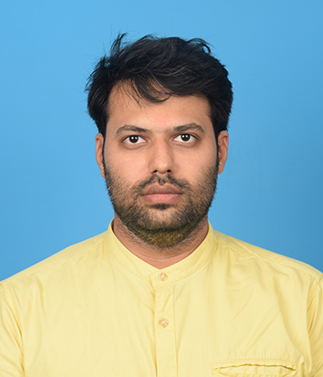
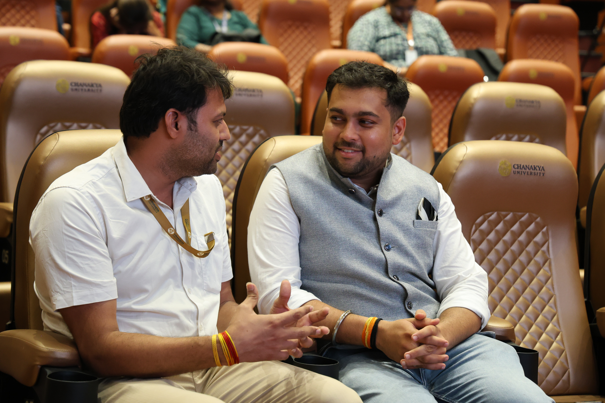

# Anupam Sharma

**Assistant Professor | Chanakya University | Bengaluru (KA)**

I am an Energy Engineer pursuing research at the intersection of **Power Systems and Cybersecurity**. My work focuses on making renewable energy grids more resilient against cyber-physical threats.

 

---

### 🔬 Research Projects
* **Smart Grid Resilience with AI:** Developing frameworks to detect and mitigate false data injection in renewable energy systems.

### 📄 Documents
* [View Master's Thesis](https://drive.google.com/file/d/1b6ItVG8U-A4hYZOGlgmvOKtvTcOuiLSV/view?usp=sharing)
* [View Master's Transcript](https://drive.google.com/file/d/1wghNhcBVAc0jC6igDb7UANTd2bufFYbZ/view?usp=drive_link)

### 🛠️ Skills
* **Energy Modeling:** SAM, SOLTRACE, MATLAB.
* **Cybersecurity:** Network Security, Python (Scikit-learn).

### 📖 Teaching Portfolio
* **Courses Taught:** Electrical Circuits & Networks [EVE 201], Engineering Mathematics III [EBS 105] 
* **Pedagogy:** Committed to active learning and student-centric mentoring.

---

### 🤝 Professional Activities

*Engaging with Dr. Amey Agharkar during inauguration of Counselling Cell at Chanakya University.*
