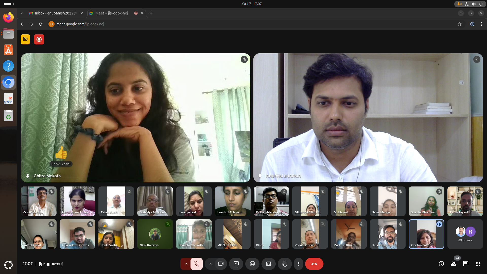
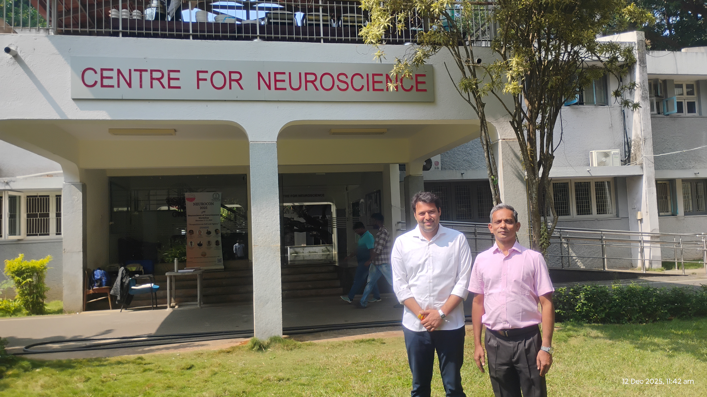
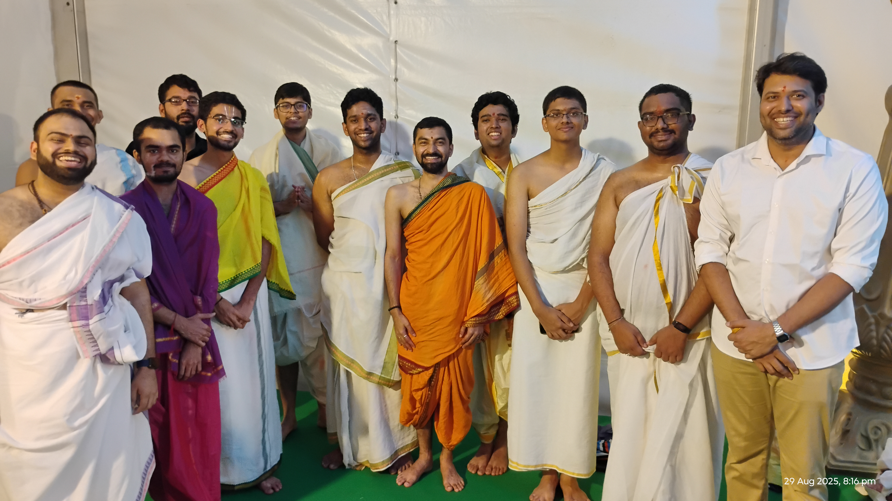
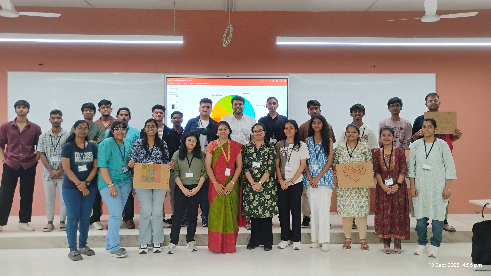
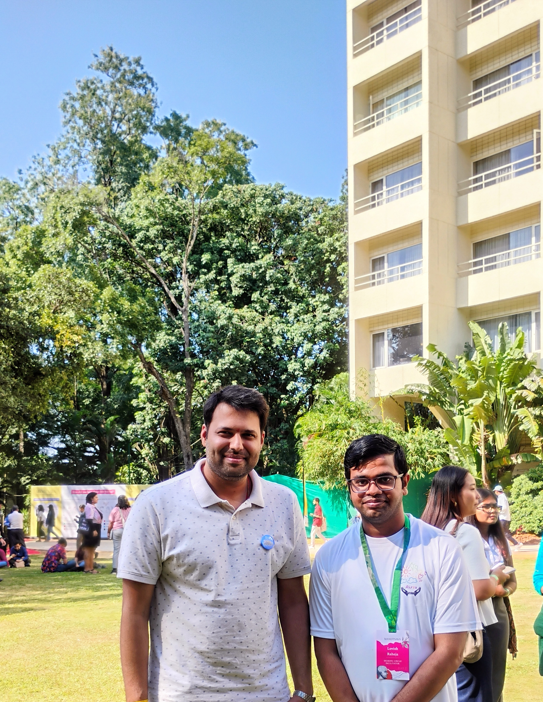

  <a href="#research">Research</a>
  <a href="#skills">Skills</a>
  <a href="#pedagogy">Pedagogy</a>
  <a href="#teaching-portfolio">Teaching</a> <a href="#activities">Activities</a>

  
  

    <h1 class="name-heading">Anupam Sharma</h1>
    <h3 style="margin:5px 0 15px 0; color:#4da6ff !important; font-weight:400;">Assistant Professor</h3>
    

      Chanakya University
      Bengaluru, India
    

  

### 🔗 Connect 
 
 

I am an Energy Engineer and Researcher dedicated to the harmony of complex systems. My work exists at the intersection of **Power Systems and Cybersecurity**, where I explore the mathematical and philosophical foundations of resilience. I believe that a truly "smart" grid must not only be efficient but also robust enough to withstand the unpredictable challenges of a digital age. Beyond the circuits, I am deeply interested in how human consciousness and psychological patterns influence our interaction with technology and education.

<h2 id="research">🔬 Research Projects</h2>

  Cyber-Physical Security
  <h3 style="margin:0 0 10px 0; color:#fff !important;">Smart Grid Resilience with Artificial Intelligence</h3>
  

    Developing advanced frameworks to detect and mitigate <b>False Data Injection Attacks (FDIA)</b> in renewable-heavy energy systems. By combining machine learning with power system physics, I aim to create "self-healing" grids that maintain integrity even under sophisticated cyber-physical threats.
  

  Interdisciplinary Systems
  <h3 style="margin:0 0 10px 0; color:#fff !important;">Cognitive Frameworks for Engineering Ethics</h3>
  

    An exploratory study into how the <b>Philosophy of Consciousness</b> and cognitive psychology can be used to model ethical decision-making in autonomous energy management systems. This project bridges the gap between technical reliability and human-centric values.
  

<h2 id="skills">🛠️ Interdisciplinary Expertise</h2>

  

    
⚡ Electrical Engineering

    <ul class="skill-list">
      <li>Power Systems Analysis</li>
      <li>Smart Grid Resilience</li>
      <li>Renewable Energy Integration</li>
      <li>Software: SAM, SOLTRACE</li>
    </ul>
  

  

    
🔢 Mathematical Sciences

    <ul class="skill-list">
      <li>Engineering Mathematics</li>
      <li>Cyber-Physical Modeling</li>
      <li>Python-based Visualization</li>
      <li>Statistical Analysis</li>
    </ul>
  

  

    
🧠 Humanities & Social Sciences

    <ul class="skill-list">
      <li>Philosophy of Consciousness</li>
      <li>Educational Psychology</li>
      <li>Student-Centric Mentoring</li>
      <li>Interdisciplinary Pedagogy</li>
    </ul>
  

<h2 id="pedagogy">📖 Pedagogy</h2>

  
    "Education is not the filling of a pail, but the lighting of a fire—a fire that must illuminate both the circuit and the soul."
  
  
  

    My practice of <b>Interdisciplinary Pedagogy</b> is rooted in the belief that technical systems are reflections of human logic and universal order. I bridge <b>Mathematical Rigor</b> with <b>Cognitive Psychology</b> to guide students beyond rote memorization into the realm of 'Deep Understanding.' 
      
    I view the classroom as a space for <b>Holistic Mentoring</b>, where we don't just solve for variables, but cultivate the resilience and philosophical clarity required to navigate the complexities of life and technology alike.
  

  

    ✧ Existential Clarity
    ✧ Cognitive Scaffolding
    ✧ Ethical Engineering
    ✧ Conscious Mentorship
  

<h2 id="teaching-portfolio">📚 Teaching Portfolio</h2>

  

    

      Current Semester (2026)
    

    <ul style="list-style:none; padding:0;">
      
      <li class="course-item-container">
  EEC 206 <b style="font-size: 1.1em;">Power & Energy Engineering</b>
  
  

    📚 Active Course Resources
      
    

      <a href="https://drive.google.com/file/d/1gno0vbTaHJ9TO_xrS9dujNnhCGPwxVYW/view?usp=sharing" class="resource-link">Lecture 1 (Energy scenario in KARNATAKA) Handout</a>
      <a href="https://drive.google.com/file/d/1qqxNkeUaeQMwT8CTcod_krdLyCIFLo1E/view?usp=sharing" class="resource-link">Lecture 2 (Energy scenario in INDIA) Handout</a>
      <a href="https://drive.google.com/file/d/1hUTMhjqRDcAgFi0Ujqo4jI5fiQBdHPfL/view?usp=sharing" class="resource-link" style="border-color: #ff4d4d; color: #ff4d4d !important;">📝 Quiz 1 Paper</a>
    

  

  

  🔬 POWER & ENERGY RESEARCH GROUP
  

    Supervising advanced research in sustainable grid architectures and system resilience.
  

  
  <table style="width: 100%; font-size: 0.9em; border-collapse: collapse; color: #ffffff;">
    <thead>
      <tr style="text-align: left; background: rgba(0, 255, 204, 0.15);">
        <th style="padding: 12px; color: #00ffcc; border-bottom: 2px solid #00ffcc;">Group Member</th>
        <th style="padding: 12px; color: #00ffcc; border-bottom: 2px solid #00ffcc;">Research Project Title</th>
      </tr>
    </thead>
    <tbody>
      <tr style="border-bottom: 1px solid #3d446d; transition: 0.3s;" onmouseover="this.style.backgroundColor='rgba(255,255,255,0.05)'" onmouseout="this.style.backgroundColor='transparent'">
        <td style="padding: 15px 12px; font-weight: 600;">Monish Y</td>
        <td style="padding: 15px 12px; color: #cbd5e0; font-style: italic;">"132/33kV Substation Design with Protection Schemes."</td>
      </tr>
      <tr style="border-bottom: 1px solid #3d446d; transition: 0.3s;" onmouseover="this.style.backgroundColor='rgba(255,255,255,0.05)'" onmouseout="this.style.backgroundColor='transparent'">
        <td style="padding: 15px 12px; font-weight: 600;">Supriya A Mahajan, Manikanta RA, Shrusti J </td>
        <td style="padding: 15px 12px; color: #cbd5e0; font-style: italic;">"Block Chain Peer-to-Peer Energy Trading in Prosumer Centric Society"</td>
      </tr>
    </tbody>
  </table>

  
</li>
      
      <li class="course-item-container">
        EVE 208 <b>Analog Systems</b>
        

    📚 Active Course Resources
      
    

      
      <a href="https://drive.google.com/file/d/1MZ_lKUCFu9hK0UXtzVeF-f8u_jf7X7Ap/view?usp=sharing" class="resource-link" style="border-color: #ff4d4d; color: #ff4d4d !important;">📝 Quiz 1 Paper</a>
    

  

      </li>
      
    </ul>
  

  

    

      Previous Semester (2025)
    

    <ul style="list-style:none; padding:0;">
      
      <li class="course-item-container">
        EBS 105 <b style="font-size: 1.1em;">Engineering Mathematics III</b>
        
        

          📑 Course Handouts
          <a href="https://drive.google.com/file/d/1pPQ9Hb1LsV7vNUL05UflZ9BNbnYdtAfr/view?usp=sharing" class="resource-link">Module 1</a>
          <a href="https://drive.google.com/file/d/1I9osa5VRPm9-WgI5XPhP49ZDCP6l6H8v/view?usp=sharing" class="resource-link">Module 2</a>
          <a href="https://drive.google.com/file/d/1RENXKVLqOhgRMB2gaKYpaA43gADfv1PO/view?usp=sharing" class="resource-link">Module 3</a>
          <a href="https://drive.google.com/file/d/1hkcCUNMupXrSfPFgP4GpyfXC8_2ZCsqj/view?usp=sharing" class="resource-link">Module 4</a>
        

        

          📝 Practice & Assessment
          <a href="https://drive.google.com/file/d/1FUlFmL2o6mHJBfdZJWqzAnYAsDVGQE4G/view?usp=sharing" class="resource-link">Tutesheet 1</a>
          <a href="https://drive.google.com/file/d/1pUFKXvwGb_xbJPpaRBo48DtKUZ-hG-dV/view?usp=sharing" class="resource-link">Tutesheet 2</a>
          <a href="https://drive.google.com/file/d/1A1GTUVFAz75ApxzmyMeI3LZcZj0SQKSL/view?usp=sharing" class="resource-link" style="border-color: #ff4d4d; color: #ff4d4d !important;">Mid-Sem Paper</a>
          <a href="https://drive.google.com/file/d/1arKXuai_l1WCrmfcECOg51B_pGMzwhaA/view?usp=sharing" class="resource-link" style="border-color: #ff4d4d; color: #ff4d4d !important;">End-Sem Paper</a>
        

        

          🚀 Student Innovation Showcase
          

            Mentored <b>42 students</b> in mathematical modeling applications.
          

          <a href="https://drive.google.com/drive/folders/1m40JeT4f-BFwqWuPyEwQs3OP4uCZjTQL?usp=sharing" class="resource-link" style="border-color: #ffd700; color: #ffd700 !important; font-weight: bold; padding: 8px 16px;">
            📂 View All 42 Reports
          </a>
          

             <a href="https://drive.google.com/file/d/1gLUrvtWevzw-nzK8IwwdEvq6kv4dBRQW/view?usp=sharing" class="resource-link" style="font-size: 0.75em; opacity: 0.9;">🌟 Featured: 3D Rocket Dynamics</a>
             <a href="https://drive.google.com/file/d/1k_AZxUBp_vlZCZJHkYD8pZTI6_oI8IPV/view?usp=sharing" class="resource-link" style="font-size: 0.75em; opacity: 0.9;">🌟 Featured: Quarter Car Suspension</a>
          

        

      </li>

      <li class="course-item-container" style="border-top: 1px solid #3d446d; padding-top: 25px; margin-top: 30px;">
  EVE 201 <b style="font-size: 1.1em;">Electrical Circuits & Networks</b>
  
  

    📑 Course Resources
    <a href="https://drive.google.com/file/d/1icZUJseGWW1wIHXJJv1brDBUDAeeJrs-/view?usp=sharing" class="resource-link">Lab Manual</a>
    <a href="https://drive.google.com/file/d/15YuIidPokCKyR7rnbDjcm6wmNagPdIQe/view?usp=sharing" class="resource-link">Lab Videos</a>
  

  

    🎯 Assessment Archive
    <a href="https://drive.google.com/file/d/1ANuHKQUO-MUd4oOLY_2HwB_I3d2wlT4y/view?usp=sharing" class="resource-link" style="border-color: #ff4d4d; color: #ff4d4d !important;">Mid-Sem Paper</a>
    <a href="https://drive.google.com/file/d/1iAmq5YH-mwjNZko_6nzF6kKj_W3q9cj6/view?usp=sharing" class="resource-link" style="border-color: #ff4d4d; color: #ff4d4d !important;">End-Sem Paper</a>
  

  

    🚀 Student Innovation Projects
    

      <a href="https://drive.google.com/file/d/1qDMkhz9DzY9TZ2p1jgd1VGzZ9G2f7Huv/view?usp=sharing" class="resource-link" style="border-color: #ffd700; color: #ffd700 !important;">📁 Incandescent Bulb</a>
      
    

  

</li>

    </ul>
  

<h2 id="activities">🤝 Professional Activities</h2>

  

    
    
Inauguration of the Counselling Cell at Chanakya University with Dr. Amey Agharkar.

  

  

    
    
124th Guru Dakshata (Online) Faculty Induction Program at Goa University.

  

  

    
    
Engaging with Prof. CA Tomy (UoH) during NeuroConsciousness Workshop at IISc.

  

  

    
    
Engaging with Scholars and Masters Students at IISc during Ganesh Chaturthi.

  

  

    
    
During Student Induction Program at Chanakya University with Prof. Akhila.

  

  

    
    
Engaging with Lovish Raheja (IIT Bombay-Monash) during Manotsava 2025.

  

  
  

    ✦ ✦ ✦
  

  
  

    "In the grid, as in life, resilience is not just about resisting the storm, but about having the internal architecture to keep the light burning when the world goes dark. Whether I am securing a power system or mentoring a student, my goal remains the same: to build systems—and souls—that are unbreakable."
  

  
  

    Anupam Sharma
  

